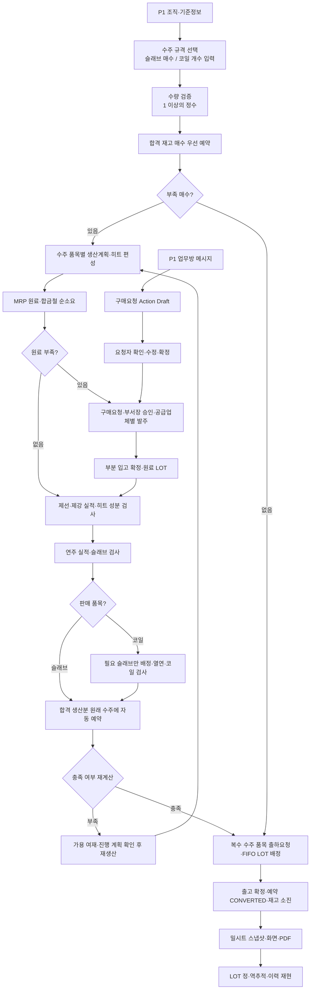

> 노션 스냅샷 (2026-09-30) · 원본: https://app.notion.com/p/3ebfd862227080b0beadf2f854f770c3

# 🔄 업무 프로세스 정의서

> 📌 **문서 기준**: [기준 문서 1 (Notion 링크)](https://app.notion.com/p/3eb2e17a4d8a81529f69e51afe62f302)와 [기준 문서 2 (Notion 링크)](https://app.notion.com/p/3eb2e17a4d8a817bb98fdb7e47f67829)을 기준으로 하고, 용어·영문명·DB명은 [용어 사전 (Notion 링크)](https://app.notion.com/p/3eb2e17a4d8a81709414f38f145572a7)을 따른다. HTML 기획안은 참고용이다.
> **표기**: **요구사항** = 기준 문서에서 확인한 내용 / **구현 제안** = 데이터·코드·API·예외 처리 제안 / **TBD** = 팀 결정 필요. 업무 ID는 `BP-영역-번호`, 요구사항 ID는 `REQ-영역-번호`.
> 실제 소스코드·DB를 확인한 문서가 아니며 코드는 설계 제안이다. 기술 스택은 기획안을 따른다.

작성일: 2026-09-30 · 버전: v2 · 상태: 기준 문서 v2 반영

## 1. 목적·범위·우선순위

수주생산(MTO) 방식으로 원료 입고 → 제선 → 제강 → 연주 → 열연 → 출하를 연결한다. 합격 재고를 먼저 예약하고 부족 매수만 생산하며, 구매·검사·출고의 확정과 LOT 계보·작업 로그를 남긴다. 슬래브는 연주·검사 후 판매할 수 있고 코일은 열연·검사 후 판매한다.

| 등급 | 대상 업무 | 완료 기준 |
| --- | --- | --- |
| P1 | 로그인·권한, 조직관리, 기준정보, 수주, 생산·MRP, 재고·예약·배정, 구매, 품질, 출하, LOT, 작업 로그, 업무·알림, 업무형 메신저, Message → ERP 구매요청 | 반드시 완성하고 전체 흐름 시연 |
| P2 | AI Factory Agent(조달 자동화 포함), Voice2ERP, AI 어시스턴트(패널·@AI), Message → ERP 확장 유형, 예약 정합성 보정 배치(REQ-INV-010) | P1 이후 순차 연결 |
| P3 | 대시보드·위젯 | P2 이후 진행 |
| EX | 과거 사례 DB(등록·검색·요약) | 추가 기능 |

**제외 (요구사항 20장)**: 고철 구매, 슬래그 출하, 실중량 계량, 야드 내 위치 관리, 설비·생산능력 관리, 톤 단위 수주, 허용오차·고객 승인, 예약 만료, 원료 입고 검사, 원료 안전재고, 운송 정보, 재고생산, 인사·휴가·급여, 견적, 납기 검증(Promise Engine).

불합격 처리는 품질 담당이 처리 상태(보류·격하·폐기)를 지정하고 사유를 기록하는 데까지만 구현한다(REQ-QC-004). 격하 재판정·재작업·폐기 재고 처리는 만들지 않는다.

프로세스에서 제시하는 변경·재시도·동시성 통제는 기존 업무를 안전하게 구현하기 위한 제안이며, 회계·운송·설비 계획 기능을 새로 추가하는 의미가 아니다.

## 2. 업무 주체와 책임

역할 목록·접근 범위는 TBD이며 아래는 업무 책임을 정리한 것이다.

| 주체 | 업무 책임 | 시스템 권한 제안 |
| --- | --- | --- |
| 관리자 | 사원·부서(계층·부서장)·직급·역할·기준정보 관리 | EMPLOYEE_MANAGE, ORG_MANAGE, MASTER_MANAGE |
| 영업 | 수주 등록·취소, 충족 현황, 출하요청 | ORDER_CREATE, ORDER_CANCEL, SHIPMENT_REQUEST |
| 구매 | MRP 확인, 구매요청·발주·입고 확정 | PURCHASE_REQUISITION_CREATE, PO_CONFIRM, RECEIPT_CONFIRM |
| 생산 | 계획·히트 편성·실적, 열연 슬래브 배정, 재생산 | PLAN_CONFIRM, RESULT_CONFIRM, ROLLING_ALLOCATE |
| 품질 | 측정값 입력·판정 확인, 불합격 처리 상태 지정, 과거 사례 등록 | INSPECTION_REGISTER, DISPOSITION_SET, CASE_REGISTER |
| 물류 | 출고 확정, 밀시트 조회·PDF | GOODS_ISSUE_CONFIRM, MILLSHEET_READ |
| 부서장 | 구매요청 승인, Agent 대응 후보 승인 (조직관리에서 지정) | PURCHASE_REQUISITION_APPROVE, AGENT_DRAFT_APPROVE |
| 전 사용자 | AI 어시스턴트로 용어·절차 질문, 데이터 조회, 실행 카드 확정 | 본인 업무 권한 범위 |
| 시스템 | 규칙 판정·자동 예약·로그·알림(P2: 보정 배치·Agent 감지) | 지정된 내부 업무만 실행 |

**관련 요구사항**: REQ-AUTH-001\~004, REQ-ORG-001\~004.

**구현 제안**: 역할과 대상 접근 범위를 서버에서 검사한다. 사용자 ID·승인 권한은 인증 컨텍스트에서 가져오고 클라이언트나 AI가 전달한 역할값을 신뢰하지 않는다. 승인권자는 요청자 소속 부서의 부서장(REQ-ORG-002)으로 연결한다. 부서장 미지정·자기 요청 승인·부서장 변경 시 경로는 TBD이며, 설정 없이 자동 승인하지 않는다.

## 3. 전체 프로세스



품질 불합격은 해당 LOT와 불합격 히트 하위 LOT의 예약·배정·출고를 막는다. 품질 담당이 처리 상태를 지정한 뒤 과거 사례로 등록할 수 있다(EX). P2 Agent는 위험과 대응 초안을 만들며 승인권자(부서장)가 개별 승인한 뒤 실행한다.

## 4. 핵심 업무 규칙과 계산

### 4.1 수주는 매수 입력, 톤은 계산값

**요구사항**: 수주 수량은 매수(정수)로 입력하고, 톤은 매수 × 1매 이론중량으로 계산해 표시하며 저장하지 않는다(REQ-SO-002). 화면 단위는 슬래브 매, 코일 개다. 규격별 1매 이론중량은 소수 3자리 확정값으로 저장하고, 수주·재고에 사용된 규격은 치수·이론중량을 수정할 수 없다. 다른 치수가 필요하면 새 규격을 추가한다(REQ-MST-003). 제품은 QTY, 원료는 TON이다.

**관련**: REQ-MST-001\~004, REQ-SO-002, REQ-INV-001.

```text
1매(1개) 이론중량(t) = 두께(mm) × 폭(mm) × 길이(mm) × 7.85 / 10^9
  → 소수 3자리 확정값으로 저장 (슬래브·코일 모두 자기 규격 치수로 계산)
열연 계획 수율 = 코일 1개 이론중량 ÷ 대응 슬래브 1매 이론중량   (입력하지 않음)
등록 조건 = 코일 1개 이론중량 ≤ 대응 슬래브 1매 이론중량
주문 수량 = 1 이상의 정수 (슬래브 매수, 코일 개수)
수주 톤(표시값) = 주문 수량 × 선택 규격의 1매 이론중량   (저장하지 않음)
```

7.85는 t/m³ 기준이므로 mm 치수는 10\^9으로 나눈다. 예: 250 × 1,200 × 10,000mm는 23.550t, 10매는 235.500t다.

사용된 규격은 수정할 수 없으므로 과거 수주의 톤 계산값도 바뀌지 않는다. 단위중량 스냅샷을 수주에 따로 저장하지 않는다.

**구현 제안**: 수량은 UI와 서버에서 정수로 검증하고 소수·0·음수·누락을 거부한다. 수량을 반올림하거나 톤에서 매수로 환산하지 않는다. 톤은 조회 시 서버가 규격 마스터로 계산하며 십진수 연산을 쓴다. 규격 수정 API는 "해당 규격을 참조하는 수주·재고·LOT가 있는지"를 확인하고 있으면 거부한다.

### 4.2 예약은 매수, 배정은 실제 LOT

**요구사항**: 예약과 배정을 분리한다. 예약 상태는 ACTIVE / CONVERTED / RELEASED이고 만료는 없다(REQ-INV-002·005). 배정은 출하요청·열연 투입 시 합격 LOT을 FIFO로 추천하고 담당자가 확정한다. 배정은 확정 시 생성하며 상태는 CONFIRMED / CONSUMED(출고 확정·열연 투입) / RELEASED(변경·취소)다. 추천은 저장하지 않고 작업 로그로만 남긴다. 배정 대기는 출하요청 품목의 미배정 상태다(REQ-INV-006).

- **예약**: 특정 수주 품목이 사용할 제품 규격의 매수를 확보한다. 이 시점에는 실제 LOT를 정하지 않는다.
- **배정**: 출하용 배정은 해당 수주 품목 예약에, 열연용 배정은 생산계획에 연결한다. (구현 제안)
- **출고**: 배정 LOT를 소진(배정 CONSUMED)하고 출고한 매수만큼 ACTIVE 예약을 CONVERTED로 전환한다. 부분 출고는 예약을 수량별로 나눈다. (구현 제안)
- **취소**: 미출고 ACTIVE 예약을 RELEASED로 바꾸고 관련 CONFIRMED 배정을 RELEASED로 해제한다. CONVERTED 출고 이력은 유지한다. (구현 제안)
- **FIFO**: 출하 제품의 생산완료일 오름차순. 동률은 LOT 번호 순을 제안한다. 원료 입고일 FIFO와 혼동하지 않는다.

```text
예약 가용 매수
  = 미소진 합격 제품 매수
    − ACTIVE 예약 매수
    − ACTIVE 예약으로 커버되지 않는 열연용 CONFIRMED 배정 매수
```

출하 배정이 ACTIVE 예약의 일부이면 두 번 차감하지 않는다. 열연용 배정은 기존 슬래브 판매 예약을 침범하지 않는다. (구현 제안)

### 4.3 합격 재고·여재

**요구사항**: 슬래브 적격 조건은 히트 성분 합격 + 슬래브 검사 합격, 코일은 상위 히트 성분 합격 + 코일 검사 합격이다(REQ-INV-003). 불합격 LOT과 불합격 히트 하위 LOT은 예약·배정 대상에서 제외한다(REQ-INV-007). 미배정 합격 슬래브를 여재로 두고 가용재고에 포함한다(REQ-INV-008).

**구현 제안**: 이미 다른 수주에 ACTIVE 예약된 매수를 자유 재고로 노출하지 않는다. LOT의 미배정 여부와 규격별 예약 가용량을 함께 보여준다.

### 4.4 히트 편성과 MRP

**관련**: REQ-MST-004\~006·009, REQ-PRD-001\~005.

```text
목표중량(t) = 부족 매수 × 제품 1매 이론중량
필요 투입량(t) = 목표중량 ÷ 라우팅 누적 계획수율   (열연 수율은 규격 매핑에서 계산한 값)
히트 수 = ceil(필요 투입량 ÷ 히트 용량)
히트 톤(t) = 히트 수 × 히트 용량   (초기 250t, 설정값)
철광석·석탄·석회석 소요(t) = 필요 용선(t) × 용선 1t당 원단위(t/t)
합금철 소요(t) = 히트 톤(t) × 강종별 원단위(kg/t, 용강 1t당) ÷ 1,000
순소요(t) = max(0, 총소요 − 원료 LOT 잔량 − 입고예정)
```

**요구사항**: 수주 품목(강종) 기준 편성, 여재는 슬래브 단계에 남기고 코일에 필요한 슬래브만 열연한다. 원료 안전재고는 없고, 수주에 연결된 생산계획은 다른 수주의 입고예정에서 제외한다. 원료 수량은 톤(소수 3자리)이다.

**구현 제안**: 250t가 용선 투입 기준인지 용강 산출 기준인지와 누적 수율의 시작점은 TBD로 남기고, MRP에서 같은 수율을 두 번 적용하지 않는다. 합금철은 제강 투입 원료로 원료 LOT → 히트에 직접 연결한다. 입고예정은 필요일까지 도착하는 확정 발주의 미입고량만 반영하고, 같은 공급을 계획별로 중복 차감하지 않는다.

### 4.5 수주 부족과 진행률

```text
미출하 매수 = 주문 매수 − 누적 출고 확정 매수
현재 미확보 매수 = max(0, 미출하 매수 − ACTIVE 예약 매수)
추가 계획 필요 매수 = max(0, 현재 미확보 매수 − 동일 수주 품목의 진행 계획 잔여 목표 매수)
```

생산중·검사합격·예약은 같은 제품의 서로 다른 단계일 수 있어서, 더해서 주문보다 큰 "충족 매수"로 표시하지 않는다. 지표의 포함 관계와 진행률 분모를 UI·API에 명시한다. (구현 제안)

## 5. 프로세스 목록·요구사항 연결

| 업무 ID | 업무 | 등급 | 연결 요구사항 |
| --- | --- | --- | --- |
| BP-AUTH-01 | 로그인·조직·권한 | P1 | REQ-AUTH-001\~004, REQ-ORG-001\~004 |
| BP-MST-01 | 기준정보 준비 | P1 | REQ-MST-001\~009 |
| BP-SO-01 | 수주 등록·우선 예약·부족분 계획 | P1 | REQ-SO-001\~004, REQ-PRD-001, REQ-INV-001\~003 |
| BP-SO-02 | 부분 출하 상태·수주 취소 | P1 | REQ-SO-005\~006, REQ-INV-005 |
| BP-PRD-01 | 히트 편성·MRP | P1 | REQ-PRD-002·005, REQ-MST-006 |
| BP-PUR-01 | 구매요청·승인·발주 | P1 | REQ-PUR-001\~003, REQ-AUTH-004 |
| BP-PUR-02 | 부분 입고·원료 LOT | P1 | REQ-PUR-004, REQ-LOT-003\~004 |
| BP-PRD-02 | 제선·제강·연주 실적 | P1 | REQ-PRD-003·007, REQ-LOT-001\~004 |
| BP-QC-01 | 검사·판정·불합격 처리·재생산 | P1 | REQ-QC-001\~004, REQ-INV-003\~004·007, REQ-PRD-006 |
| BP-INV-01 | 열연 배정·실적·여재 | P1 | REQ-PRD-003\~004, REQ-INV-006\~009 |
| BP-INV-02 | 동시성 통제 / 예약 정합성 보정 배치 | P1 / P2 | REQ-INV-009 (P1), REQ-INV-010 (P2) |
| BP-SHP-01 | 출하요청·출고·밀시트 | P1 | REQ-SHP-001\~004, REQ-INV-005\~006 |
| BP-LOT-01 | 계보 정·역추적 | P1 | REQ-LOT-001\~005 |
| BP-LOG-01 | 작업 로그·이력 재현 | P1 | REQ-LOG-001\~003 |
| BP-MSG-01 | 업무·알림·메신저 | P1 | REQ-NTF-001\~002, REQ-MSG-001\~006 |
| BP-ACT-01 | Message → ERP 구매요청 | P1 | REQ-ACT-001\~004 |
| BP-ACT-02 | 초안 업무 유형 확장 | P2 | REQ-ACT-005 |
| BP-AGT-01 | 위험 감지·대응 후보 | P2 | REQ-AGT-001\~006, REQ-PUR-005 |
| BP-VOC-01 | Voice2ERP | P2 | REQ-VOC-001\~004 |
| BP-AST-01 | AI 어시스턴트 | P2 | REQ-AST-001\~010 |
| BP-DSH-01 | 대시보드·위젯 | P3 | REQ-DSH-001\~002 |
| BP-CASE-01 | 과거 사례 등록·검색 | EX | REQ-CASE-001\~005, REQ-AST-006 |
| BP-SEED-01 | 실적 시뮬레이션·시드 | P1 | REQ-PRD-007 |

## 6. P1 업무 상세

### 6.0 한눈에 보기

| 업무 ID | 업무 | 주체 | 핵심 흐름 | 결과물 |
| --- | --- | --- | --- | --- |
| BP-AUTH-01 | 로그인·조직·권한 | 사원·관리자 | 계정 확인 → 인증 → 역할·범위 조회 → API마다 권한 재확인 | 세션, 접근 범위, 부서 계층, 승인권자 |
| BP-MST-01 | 기준정보 준비 | 관리자 | 규격·매핑·라우팅·배합 입력 → 검증 → 이론중량 확정 | 계산 가능한 마스터(슬래브 9·코일 9) |
| BP-SO-01 | 수주 등록·예약·계획 | 영업 | 정수 수량 입력 → 톤 표시 → 합격 재고 우선 예약 → 부족분만 생산계획 | 수주, ACTIVE 예약, 생산계획 |
| BP-SO-02 | 부분 출하·수주 취소 | 영업 | 예약 RELEASED → 배정 해제 → 시작 전 계획 취소 → 진행분은 완료 후 여재 | 취소 이벤트, 여재 표시 |
| BP-PRD-01 | 히트 편성·MRP | 생산·구매 | 부족 매수 → 필요 투입량 → 히트 수 올림 → 원료 순소요 | 히트 편성표, MRP 결과 |
| BP-PUR-01 | 구매요청·승인·발주 | 구매·부서장 | 요청 → 부서장 승인 → 공급업체별 발주 | 발주, 입고예정 |
| BP-PUR-02 | 부분 입고·원료 LOT | 구매 | 미입고량 확인 → 입고 확정 → 원료 LOT 생성 | 원료 LOT, 톤 잔량 |
| BP-PRD-02 | 제선·제강·연주 실적 | 생산 | 공정별 실적(수동 또는 실적 시뮬레이션) → 투입 차감 → LOT·계보 | 용선·히트·슬래브 LOT |
| BP-QC-01 | 검사·판정·재생산 | 품질·생산 | 측정값 → 자동 판정 → 자동 예약 / 불합격 처리 상태 지정 → 여재 확인 후 재생산 | 판정, 자동 예약, 처리 상태 |
| BP-INV-01 | 열연 배정·코일 실적 | 생산 | 매핑 조회 → 합격 슬래브 FIFO 추천 → 배정 확정 → 코일 1개 생성·검사 | 코일 LOT, 여재 |
| BP-INV-02 | 동시성 통제 / 보정 배치 | 시스템 | 재고 풀 잠금 → 재검증 → 저장 / (P2) 배치로 예약 매수 비교·보정 | 일관된 예약 매수 |
| BP-SHP-01 | 출하·출고·밀시트 | 영업·물류 | 출하요청 → FIFO LOT 배정 → 출고 재검증 → CONVERTED → 밀시트·PDF | 출고 기록, 밀시트 |
| BP-LOT-01 | LOT 정·역추적 | 전원 | 역추적(코일→원료), 정추적(원료·히트→출하) | 계보 조회 |
| BP-LOG-01 | 작업 로그 | 시스템 | 주체·대상·전후값·사유를 이벤트로 기록 | 수주·LOT 타임라인 |
| BP-MSG-01 | 업무·알림·메신저 | 전원 | 방 생성 → 메시지·첨부 → 읽음 → 멘션 알림 → ERP 이동 | 메시지, 알림 |
| BP-ACT-01 | Message → ERP 구매요청 | 요청자·부서장 | 메시지 → AI 추출 → 요청자 확정 → 구매요청 생성 → 부서장 승인 | 구매요청, 로그 |

아래 업무 제목을 펼치면 정상 흐름이 보이고, 입력·출력, 예외 처리, 주요 코드·데이터는 안쪽 토글에 있다. 테이블명은 용어 사전 DB명(snake_case 단수)을 따르고, 용어 사전에 없는 이름은 구현 제안이다.

### BP-AUTH-01 로그인·조직·권한

**정상 흐름**: 계정 상태 확인 → 인증 → 역할·대상 범위 조회 → 업무 화면 진입 → 각 API에서 권한 재확인 → 로그아웃 시 세션 종료.

**▼ 입력·출력·조직관리**

**주체/시작**: 사원이 로그인하고 관리자가 사원·부서·직급·역할을 설정한다.

**입력 → 출력**: 사원번호·비밀번호·조직·역할 → JWT 세션, 메뉴·기능 접근 범위, 승인권자.

**조직관리 (요구사항)**: 부서에 상위 부서를 지정해 계층으로 관리하고, 부서별 부서장 1명을 지정하며, 조직도(부서 트리와 인원)를 조회한다. 승인권자·부서 알림 대상·메신저 멤버 선택은 조직 정보를 사용한다(REQ-ORG-001\~004).

**▼ 예외 처리**

**구현 제안**: 비활성 계정·인증 실패·권한 없음은 차단한다. 승인 권한이 없는 사용자는 구매·Agent 승인 명령을 호출할 수 없다. 부서 계층에 순환(자기 자신을 상위로 지정)을 막는다. 토큰 만료·갱신·실패 제한 등 NFR은 16장 참조.

**▼ 주요 코드/데이터**

AuthenticationService, AuthorizationPolicy, OrganizationService / `employee`, `department`(parent_id, `head_employee_id`), `role`, `employee_role`(구현 제안)

### BP-MST-01 기준정보 준비

**정상 흐름**: 값 입력 → 단위·중복·참조 검증 → 이론중량 확정 → 슬래브 규격당 대응 코일 규격 1개 연결(코일 중량 ≤ 슬래브 중량 확인) → 열연 계획 수율 계산 → 라우팅·배합 등록 → 저장 → 업무 사용.

**▼ 입력·출력 상세**

**주체/시작**: 관리자가 운영·시연 전에 마스터를 준비한다.

**입력**: 품목(QTY/TON), 강종 SS275·SM355·SPHC와 성분 규격, 슬래브·코일 규격(강종·두께·폭·길이), 슬래브→코일 1:1 매핑, 라우팅·계획 수율(열연 제외), 배합 원단위(원료는 용선 톤당, 합금철은 용강 톤당 kg), 고객사·공급업체·품목별 기본 공급업체, 야드, 히트 용량·납기 위험 기준일.

**출력**: 업무 계산에 사용 가능한 기준정보. 초기 가정은 강종 3종 × 슬래브 규격 3종 = 슬래브 9개·코일 9개다. SM355 세부 등급과 SS275 명칭은 KS 원문 확인 전(TBD)이다.

**▼ 예외·변경 처리**

**요구사항**: 강종·두께·폭·길이 조합은 중복 등록할 수 없다. 수주·재고에 사용된 규격은 치수·이론중량을 수정할 수 없고, 다른 치수는 새 규격으로 추가한다(REQ-MST-003).

**구현 제안**: 0 이하 중량, 0 이하·1 초과 수율, 대응 코일 중복, 기본 공급업체 누락, 검사 기준 누락을 표시한다. 라우팅 순서는 DB 데이터에서 읽고 소스코드에 강종·규격별 경로를 고정하지 않는다. 아직 사용되지 않은 규격은 수정을 허용해 등록 오타를 고칠 수 있게 한다.

**▼ 주요 코드/데이터**

MasterDataService, WeightPolicy, RoutingResolver / `item`, `raw_material`, `steel_grade`, `composition_spec`, `product_spec`, `spec_mapping`, `routing`, `specific_consumption`, `customer`, `supplier`, `yard`, `production_setting`(구현 제안)

### BP-SO-01 수주 등록·우선 예약·생산계획

**정상 흐름**: 규격 선택·수량 입력 → 1 이상 정수 검증 → 톤 계산 표시 → 수주·품목 저장(수량만) → 품목 라우팅 결정 → 합격 재고 가용 매수 조회 → 부분 예약 허용해 ACTIVE 예약 생성 → 부족 매수의 생산계획 생성 → 충족 현황 표시.

**▼ 입력·출력·업무 규칙**

**주체/시작**: 영업이 고객 수주를 등록한다.

**입력**: 고객사, 납기, 품목별 코일·슬래브 규격과 수량(슬래브 매, 코일 개).

**출력**: 수주, 품목(규격·주문 수량), ACTIVE 예약, 부족 매수, 수주 품목에 연결된 생산계획. 톤은 조회 시 계산해 보여준다. 실제 LOT 지정은 출하·열연 배정 때 한다.

**업무 규칙 (요구사항)**: 코일·슬래브 혼합 수주, 합격 재고 우선, 수주 품목별 생산 경로, 부족분만 생산. 제품 적격 조건은 4.3을 따른다.

**▼ 예외 처리**

**구현 제안**: 소수·0·음수·누락 수량은 거부하고 "수량은 1 이상의 정수로 입력해 주세요"라고 안내한다. 등록되지 않은 규격은 거부한다. 동일 규격 동시 수주는 재고 풀 잠금·예약 합계 검증으로 초과 예약을 막는다. 수주 등록 재시도는 같은 요청 ID로 기존 결과를 반환한다.

**▼ 주요 코드/데이터**

SalesOrderService, PositiveIntegerQuantityValidator, WeightCalculator, ReservationService, ProductionPlanService / `sales_order`, `sales_order_item`, `inventory`, `reservation`, `production_plan`

### BP-SO-02 부분 출하 상태·수주 취소

**▼ 주체·상태 조회**

**주체/시작**: 영업이 진행 현황을 조회하거나 수주 취소를 요청한다.

**상태 조회**: 품목별 주문·예약·생산중·검사합격·출하 매수 → 품목 상태 계산 → 수주 헤더 상태(부분출하·출하완료 등)를 품목 상태에서 계산(REQ-SO-005). 상세 상태 코드는 10장의 제안이다.

**취소 정상 흐름**: 취소 대상·기출고량 확인 → 수주 품목·예약·배정 잠금 → ACTIVE 예약 RELEASED → CONFIRMED 배정 RELEASED → 시작 전 생산계획 취소 → 생산 중 물량은 수주 연결을 해제하고 여재 전환 표시 → 수주 취소·계획 취소·여재 전환 이벤트 기록(REQ-SO-006).

**▼ 여재 전환·예외 처리**

**여재 전환 해석 (구현 제안)**: 용선·히트 진행분을 즉시 합격 슬래브 재고로 만들지 않는다. 조업 중 물량은 "완료 후 여재" 표시를 두고 연주·검사 완료 후 적격 슬래브 여재가 된다. 아직 열연을 시작하지 않은 코일 계획은 슬래브 단계에 남긴다. 열연이 이미 시작된 코일 계획의 처리는 16장 참조.

**예외 (구현 제안)**: 출고 완료분은 취소로 삭제하거나 재고 복원하지 않는다. 부분 출고 뒤 잔량 취소는 16장 참조.

**주요 코드/데이터**: SalesOrderCancellationService, OrderStatusCalculator / 예약 분할, 배정 해제, 계획 취소 이벤트

### BP-PRD-01 히트 편성·MRP

**▼ 주체·입력**

**주체/시작**: 생산이 부족분 생산계획을 편성하고 구매가 MRP 결과를 확인한다.

**입력**: 수주 품목의 부족 매수·강종·규격, 라우팅·수율, 히트 용량, 배합 원단위, 원료 LOT 잔량, 입고예정.

**정상 흐름**: 부족량·기존 진행 계획 확인 → 필요 투입량 계산 → 히트 수 올림 → 계획·히트 연결 → 필요 용선·원료 계산, 합금철은 히트 톤 기준 계산 → 시점별 가용 공급 차감 → 원료별 순소요·필요일 표시 → 담당자 확인.

**▼ 출력·예외 처리**

**출력**: 히트 편성표, MRP 계산 결과, 원료 총소요·순소요, 수주 연결, 예상 슬래브 여재.

**구현 제안**: 수율·배합·기준 단위가 없으면 확정하지 않는다. MRP를 다시 계산해도 같은 계획의 구매요청을 중복 생성하지 않는다. 다른 수주에 연결된 생산계획의 예정 제품을 공급으로 잡지 않는다. 수주 취소·계획 변경 시 구매 진행 영향도 표시한다.

**▼ 주요 코드/데이터**

HeatPlanningService, YieldCalculator, MrpService / `production_plan`, `mrp_run`·`mrp_requirement`(구현 제안). 구매요청 자동 초안은 P2(조달 자동화)이며 P1에서는 담당자가 결과를 참고해 등록한다.

### BP-PUR-01 구매요청·부서장 승인·발주

**▼ 주체·입력**

**주체/시작**: 구매 담당이 MRP 부족을 확인하거나 Message → ERP로 구매요청이 생성된다.

**입력**: 원료 품목, 톤 수량, 희망 입고일, 요청자·부서, 관련 계획·수주, 요청 근거.

**정상 흐름**: 구매요청 작성·생성 → 부서장 승인 대기 → 부서장 확인·승인 → 기본 공급업체·납기 확인 → 공급업체 1곳당 발주 1건으로 여러 품목 묶음 → 발주 확정 → 입고예정 반영.

**▼ 출력·예외 처리**

**출력**: 구매요청·승인 기록·공급업체별 발주·라인별 미입고량. 발주 등록은 ERP 내부 거래이며 공급업체 메일 발송까지 요구하지 않는다.

**구현 제안**: 반려 시 사유·수정 후 재승인 흐름을 둔다. 승인 전 발주, 승인량 초과, 잘못된 공급업체, 중복 발주를 차단한다. 요청을 묶거나 나눌 때 요청-발주 배분량을 보존한다. 발주 묶음 주기는 TBD다.

**▼ 주요 코드/데이터**

PurchaseRequisitionService, ApprovalService, PurchaseOrderService / `purchase_requisition`, `purchase_order`, 각 `_item`, 요청-발주 연결(구현 제안)

### BP-PUR-02 부분 입고·원료 LOT

**▼ 주체·입력**

**주체/시작**: 구매 담당이 발주 원료의 입고를 확정한다.

**입력**: 발주 라인, 원료 품목, 입고 톤 수량, 입고일, 야드.

**정상 흐름**: 발주 미입고량 확인 → 입고 초안 → 확정 → 입고 라인별 원료 LOT 생성(`RM-원료코드-YYMMDD-NNN`) → 원료 LOT 잔량 증가 → 발주 입고 누계·미입고량 갱신 → 작업 로그.

**▼ 출력·예외 처리**

**출력**: 부분 입고 기록·원료 LOT·톤 잔량. 원료 입고 검사는 하지 않는다.

**구현 제안**: 입고량 0 이하·미입고량 초과·반복 확정을 차단한다. 확정 거래 수정은 반대 거래 방식이 필요하며, 원료 투입 이후 취소 범위는 TBD다. 원료 LOT과 발주 입고 누계는 같은 트랜잭션으로 저장한다.

**▼ 주요 코드/데이터**

GoodsReceiptService, LotNumberService / `goods_receipt`, `lot`(원료), 재고 원장(구현 제안)

### BP-PRD-02 제선·제강·연주 실적

**주체/시작**: 생산이 작업 시작·완료와 공정 실적을 등록한다. 실적은 작업자가 직접 등록하거나, 시드·시연용으로 화면에서 생산계획을 선택해 실적 시뮬레이션으로 생성한다(REQ-PRD-003·007). MES 연동은 없다.

| 공정 | 입력 | 처리·출력 | LOT 관계 |
| --- | --- | --- | --- |
| 제선 | 고로 번호, 작업일시, 원료 투입 기간, 용선량 | 원료 LOT 잔량 차감, 용선 LOT(`HM-고로-YYMMDD-NN`) 생성 | 원료→용선 기간 기반 |
| 제강 | 전로 번호, 히트 편성, 용선 LOT별 투입량, 합금철 LOT별 투입량 | 용선·합금철 차감, 히트(`HT-전로-YYMMDD-NNN`) 실적, 성분 검사 대상 | 용선→히트 N:M, 합금철→히트 직접 연결(구현 제안) |
| 연주 | 히트, 규격, 슬래브 생산 매수, 작업일시 | 매별 슬래브 LOT(히트번호-SS), 표면·치수 검사 대상 | 히트→슬래브 1:N |

**▼ 기간 연결·예외 처리**

고로·전로 번호는 LOT 채번과 실적에 필요한 식별값이며 설비 마스터·생산능력 관리는 만들지 않는다(범위 제외).

**기간 연결**: 원료→용선은 기간 기반이며 시간 범위는 구현 단계에서 정한다(REQ-LOT-002). 관계에 기간·근거 유형을 저장해 정확한 실투입량처럼 표시하지 않는다. 원료 잔량 차감은 실제 투입 거래에서 한 번만 한다. (구현 제안)

**예외 (구현 제안)**: 원료·용선 음수 잔량, 동일 실적 중복, 슬래브 번호 중복, 히트 생산량을 초과하는 산출을 차단한다. 히트 미판정 상태의 연주 진행 여부는 16장 참조. 어느 경우든 미합격 히트 하위 제품의 예약·열연·출고는 차단한다.

**▼ 주요 코드/데이터**

ProductionResultService, ResultSimulationService, LotGenealogyService / `production_result`, `heat`, `hot_metal`, `slab`, `lot`, `lot_relation`, `business_event`

### BP-QC-01 검사·판정·불합격 처리·재생산

**▼ 주체·입력**

**주체/시작**: 품질 담당이 검사 측정값을 등록한다.

**입력**: 히트 성분, 슬래브 표면·치수, 코일 치수·기계적 성질. 항목·단위·값·기준·담당자·일시.

**검사 항목 기준 (요구사항)**: KS 인증심사기준의 제품 검사 항목을 참고한다. 화학성분, 인장강도, 항복강도, 연신율을 기본으로 하고 SM 계열은 샤르피 충격·탄소당량을 추가한다. 무게 검사는 이론중량만 쓰므로 제외한다(REQ-QC-002).

**정상 흐름**: 필수 항목 검증 → 강종 성분 규격·공정 min/max로 자동 판정(REQ-QC-003) → 검사값·판정 저장 → 제품 적격 조건 확인 → 원래 수주 품목의 미확보 매수 안에서 ACTIVE 자동 예약 → 부족량 재계산 → 적격 여재·진행 계획 확인 → 담당자가 부족분 재생산 계획 생성.

**불합격 처리 (요구사항)**: 품질 담당이 불합격 LOT에 처리 상태(보류·격하·폐기)를 지정하고 사유를 기록한다. 후속 로직(격하 재판정, 재작업, 폐기 재고 처리)은 구현하지 않는다. 처리 상태를 지정한 뒤 과거 사례로 등록할 수 있다(REQ-QC-004, REQ-CASE-002, EX).

**▼ 출력·예외 처리**

**출력**: 검사 기록, 합격·불합격, 자동 예약, 처리 상태, 부족분 계획, 작업 로그. P2 Agent의 재생산 자동 초안은 별도 흐름이다.

**구현 제안**: 필수 측정값·기준 누락은 합격으로 처리하지 않는다. min/max 경계 포함 여부는 16장 참조. 히트 불합격 시 하위 LOT를 적격 집계에서 빼고, 영향을 받는 예약은 규격 풀을 다시 계산해 부족분만 조정한다. 배정된 불합격 LOT는 배정을 RELEASED하고 출고·투입을 차단한다. 처리 상태 값(예: HOLD, DOWNGRADED, SCRAPPED)은 공통코드에서 확정한다.

**▼ 주요 코드/데이터**

QualityInspectionService, QualityEligibilityPolicy, AutoReservationService, ReproductionPlanService / `quality_inspection`, `inspection_item`, `lot.disposition_status`(구현 제안)

### BP-INV-01 슬래브 열연 배정·코일 실적·여재

**▼ 주체·입력**

**주체/시작**: 생산이 코일 계획의 필요 매수를 열연에 투입한다.

**입력**: 코일 수주 품목·계획, 대응 슬래브 규격, 필요 매수.

**정상 흐름**: 1:1 규격 매핑 조회 → 히트 성분 + 슬래브 검사 합격·미소진·타 수주 예약 비침범 재고 확인 → 필요 매수만 FIFO 추천(로그 기록) → 담당자 배정 확정(CONFIRMED) → 실제 투입 시 슬래브 소비(CONSUMED) → 매별 코일 1개 생성(`C` + 슬래브번호) → 슬래브→코일 1:1 연결 → 코일 검사 → 합격 코일 원래 수주에 자동 예약.

**▼ 출력·예외 처리**

**출력**: 열연 배정·실적·코일 LOT·검사·예약. 남은 합격 미배정 슬래브는 여재이며 가용재고에 포함한다.

**구현 제안**: 같은 슬래브를 판매 출하와 열연에 동시에 배정하지 않는다. 투입 전 배정 변경은 기존 배정 RELEASED 후 새 배정을 같은 트랜잭션에서 검증한다. CONSUMED 배정은 변경할 수 없다.

**▼ 주요 코드/데이터**

AllocationService, RollingService, SurplusInventoryQuery / `allocation`, `production_result`, `coil`, `lot_relation`

### BP-INV-02 동시성 통제(P1)·예약 정합성 보정(P2)

**P1 정상 흐름 (구현 제안)**: 규격별 재고 풀·대상 행 잠금 → 품질·잔량·예약·배정 재검증 → 변경 저장 → 예약과 `reserved_qty`를 같은 트랜잭션에서 갱신 → 이벤트 기록(REQ-INV-009, 기획안 리스크 대응).

**P2 보정 배치**: 주기적으로 ACTIVE 예약 합계와 재고의 `reserved_qty`를 비교하고 불일치 시 보정한다(REQ-INV-010).

**불변조건**: 예약 가용 ≥ 0, LOT당 CONFIRMED 배정 1건, `reserved_qty` = ACTIVE 예약 매수 합계.

**▼ 예외 처리·주요 코드**

**구현 제안**: 보정 배치는 담당자 알림·보정 전후 이벤트를 남기고, 예약을 임의로 삭제해 맞추지 않는다. 배치는 실시간 동시성 통제를 대신하지 않는다. 주기·잠금 방식은 16장 참조.

InventoryConcurrencyGuard, ReservationReconciliationJob(P2) / `inventory`, `reservation`, `business_event`

### BP-SHP-01 출하요청·LOT 배정·출고·밀시트

**▼ 주체·입력**

**주체/시작**: 영업이 여러 수주 품목을 묶어 출하요청하고 물류가 출고를 확정한다.

**입력**: 수주 품목별 출하 매수·고객사·출하일, 실제 제품 LOT 배정.

**정상 흐름**: 출하요청 → ACTIVE 예약·출하 가능 잔량 확인(미배정 품목은 배정 대기) → 강종·규격·품질 적격 LOT FIFO 추천 → 담당자 배정 확정 → 물류가 출고 확정(Goods Issue) 시 품질·배정·재고 재검증 → 배정 CONSUMED·재고 소진·예약 CONVERTED → 품목·헤더 출하 상태 갱신 → 히트 성분과 슬래브·코일 검사값으로 밀시트 스냅샷 생성 → 조회 → PDF 생성 버튼(REQ-SHP-001\~004).

**▼ 출력·예외 처리·문서 보존**

**출력**: 출하·출고 기록, 예약 전환, 제품 재고 감소, 발행 시점 밀시트, PDF. 부분 출고면 해당 매수만 전환한다.

**구현 제안**: 미검사·불합격 히트·제품, 이미 소진된 LOT, 예약·주문 잔량 초과는 차단한다. 배정 변경은 출고 전까지 재검증 후 허용한다. 묶음 출하의 고객 조건은 16장 참조.

**문서 보존 (요구사항·구현 제안)**: 밀시트는 발행 시점 값을 스냅샷으로 저장한다(REQ-SHP-003). 고객사·수주·규격·LOT·히트·이론중량·검사 항목과 값·발행일을 복사한다. PDF 렌더링 실패는 같은 스냅샷으로 재시도하며 출고를 반복하지 않는다.

**▼ 주요 코드/데이터**

ShipmentRequestService, GoodsIssueService, MillSheetSnapshotService, PdfRenderService / `shipment_request`, `goods_issue`(구현 제안), `mill_sheet`

### BP-LOT-01 LOT 정·역추적

**입력**: 코일·슬래브·히트·원료 LOT 번호 또는 출하번호.

**역추적**: 코일 → 슬래브 → 히트 → 용선 → 원료. 슬래브 출하는 코일 단계를 생략한다. 제강에 직접 투입된 합금철도 보여준다.

**정추적**: 원료·히트 → 영향받은 하위 LOT → 대상 수주·출하. N:M 용선 연결, 히트당 다수 슬래브, 슬래브당 코일 1개를 보존한다(REQ-LOT-005).

**▼ 예외 처리·주요 코드**

**구현 제안**: 계보를 LOT 번호 문자열 파싱으로 만들지 않고 `lot_relation`의 부모·자식 내부 ID를 조회한다. 순환·자기 연결을 막고, 원료 기간 연결은 근거 유형(기간 기반)과 시간 범위를 표시한다.

LotTraceService / `lot`, `lot_relation`, 출고 품목

### BP-LOG-01 작업 로그·이력 재현

**기록 (요구사항)**: 주체 구분(USER / SYSTEM), 대상, 이벤트 유형, 변경 전·후 데이터, 시각, 사유·근거, 원본 메시지·Action Draft 연결(REQ-LOG-001). AI 초안으로 확정한 작업은 "AI 경유"로 표시한다(REQ-AST-010, P2).

**▼ 이벤트 대상·출력**

**이벤트 대상 (REQ-LOG-002)**: 작업 시작·완료, 실적·검사 등록 / 예약 생성·전환·해제·자동 예약 / 배정 추천·확정·변경·해제 / 수주 취소 / 재생산 계획 생성, 생산계획 취소, 여재 전환 / 불합격 판정·처리 상태 지정 / 구매요청 확정·승인 / Action Draft 생성·승인·실행 / AI 실행 카드 확정(P2 구현 시) / Agent 위험 감지(P2 구현 시) / 과거 사례 등록(EX 구현 시).

**출력**: 수주·LOT 단위 시간순 타임라인(REQ-LOG-003). 동률은 이벤트 ID 순을 제안한다.

**▼ 예외 처리·주요 코드**

**구현 제안**: 본 거래와 이벤트는 같은 트랜잭션 또는 복구 가능한 outbox로 저장한다. 사용자가 확정한 AI 실행은 주체 USER, 자동 감지는 SYSTEM으로 기록한다. 비밀정보·인증 토큰은 전후 데이터에 저장하지 않는다. 기록 방식(service 직접 호출 vs 이벤트 발행)은 컨벤션의 미정 항목이다.

BusinessEventRecorder, DecisionReplayQuery / `business_event`

### BP-MSG-01 업무·알림·메신저

**정상 흐름**: 1:1·그룹·업무방 생성(멤버는 조직 정보에서 선택) → 업무방 상단 수주 요약 → 실시간 메시지 → 첨부 업로드·다운로드 → 사용자별 마지막 읽은 메시지 갱신 → 안 읽은 수 집계 → 멘션·업무방 새 메시지를 개인·부서 알림으로 전달 → 관련 ERP 화면 이동(REQ-MSG-001\~006, REQ-NTF-001\~002).

**▼ 예외 처리·주요 코드**

**구현 제안**: 방 멤버 권한과 ERP 대상 조회 권한을 모두 확인한다. 첨부파일에도 방 접근 권한을 적용한다. 파일 형식·용량 제한은 구현 단계에서 정한다. 같은 알림은 이벤트 ID·수신자 조합으로 중복 생성하지 않는다.

ChatRoomService, MessageService, NotificationService / `chat_room`, `message`, 읽음 위치, `task`, `notification`

### BP-ACT-01 Message → ERP 구매요청

**주체/시작**: 업무방 메시지에서 구매요청 내용이 추출된다(P1).

**입력**: 원본 메시지·작성자·작성시각, 원료 품목·수량(톤)·희망 입고일·요청자(REQ-ACT-001).

**정상 흐름**: 메시지 선택 → AI가 추출 스키마로 추출 → 원료 마스터 매핑·단위·날짜 검증 → 원본 연결 Action Draft `AI_GENERATED` → 요청자 확인 대기 `WAITING_APPROVAL` → 요청자가 확인·수정·확정 `APPROVED` → 구매 모듈 실행 핸들러로 구매요청 생성 `EXECUTED` → 생성된 구매요청은 부서장 승인 대기 → 승인 후 발주(REQ-ACT-002·003).

**두 승인의 구분 (요구사항)**: Action Draft의 확정 주체는 유형별로 다르다. 구매요청 초안은 요청자, AI 실행 카드는 사용자, Agent 대응 후보는 승인권자다. 구매요청 초안이 EXECUTED되어도 생성된 구매요청은 별도로 부서장 승인을 거친다. 반려하면 `REJECTED`로 끝난다.

**▼ 예외 처리·확장 구조**

**구현 제안**: 모호한 품목, 누락 수량·날짜, 단위 혼동은 미확정 필드로 보여주고 실행하지 않는다. 상대 날짜는 메시지 작성일 기준으로 절대 날짜를 제시한다. 요청자는 메시지 작성자로 두고 AI가 임의 지정하지 않는다. 중복 실행은 원본 메시지·유형·초안 ID로 막는다.

**확장 구조 (요구사항)**: 업무 유형별로 추출 스키마와 실행 핸들러를 등록한다(REQ-ACT-004). 실행 핸들러는 해당 모듈 담당자가 구현한다(기획안 역할 분담 원칙). 실행은 사용자 권한과 업무 검증을 거치는 명령 API로 하며 AI에 DB 쓰기 권한을 주지 않는다.

**▼ 주요 코드/데이터**

MessageActionExtractor, ActionSchemaRegistry, ActionDraftService, PurchaseRequisitionActionHandler / `action_draft`(`draft_status`), 원본·실행 결과 연결

## 7. P2·P3·EX 프로세스

### BP-AGT-01 AI Factory Agent 위험·대응 후보 (P2)

**관련**: REQ-AGT-001\~006, REQ-PUR-005.

| 위험 코드 제안 | 트리거 | 규칙·대응 |
| --- | --- | --- |
| RAW_SHORTAGE | 스케줄 | 생산계획 소요량이 원료 잔량 + 입고예정보다 큼 → 구매요청 초안(조달 자동화) |
| GOOD_QTY_SHORTAGE | 검사 등록 이벤트 | 합격 매수가 수주 대비 부족 → 재생산 계획 초안 |
| DUE_RISK | 스케줄 | 납기일까지 남은 일수가 기준일(초기 3일, REQ-MST-009) 이하이고 출하 매수가 수주 매수보다 적음 → 담당자 알림 |
| AGED_SURPLUS | 스케줄 | 여재 장기 보유 → 대기 수주 배정 추천 |
| QUALITY_RATE_RISE | 스케줄 | 강종별 불합격률 기준 초과 → 품질 부서 알림 |

**정상 흐름**: 규칙 계산 → 같은 대상의 미처리 초안(EXECUTED·REJECTED 이외) 확인 → 없으면 Action Draft 생성 → AI가 조회 근거로 상황 설명 → 승인권자(부서장)가 후보별 승인 → 해당 모듈 핸들러 실행 → 결과·로그·알림.

**구현 제안**: AI는 대응 후보를 정하지 않고 설명만 한다(REQ-AGT-006). 승인 전 위험이 해소되면 재검증으로 실행을 막는다. 여재 보유일·불합격률 기간·스케줄 주기는 TBD다. 납기 위험은 규칙 알림이며 납기 검증(Promise Engine)은 범위 제외다.

### BP-VOC-01 Voice2ERP (P2)

**관련**: REQ-VOC-001\~004.

회의 음성 입력 → STT 전체 텍스트 → 날짜·참석자·기록 저장 → AI 요약·결정사항·담당자·마감일 추출 → 사용자 확인 → 구매 항목은 BP-ACT-01 초안으로, 그 외는 업무·알림 할 일로 등록.

**구현 제안**: 담당자·날짜가 모호하면 확인 전 등록하지 않는다. 원본 전사와 AI 요약을 구분한다. 입력 방식·STT 제공자·비용은 TBD다.

### BP-AST-01 AI 어시스턴트 (P2)

**관련**: REQ-AST-001\~010.

**호출**: 모든 화면 오른쪽 패널(1:1) 또는 사내 채팅 @AI. 같은 AI이며 보고 있는 화면 정보(예: 열어 둔 수주번호)를 함께 전달한다.

**기능**: 업무 지식(용어 사전·역할별 업무 매뉴얼에서 출처와 함께 설명) / 데이터 조회(권한이 검증된 조회 API로 사용자 권한 범위 데이터) / 업무 초안(배정 추천, 히트 편성안, 수주 등록 초안, 사례 초안을 Action Draft 실행 카드로 제시하고 사용자가 확정하면 사용자 권한으로 ERP 실행) / 과거 사례 검색(EX) / 역할별 추천 질문.

**안전 규칙 (요구사항)**: AI는 업무 데이터를 직접 바꾸지 않는다. 숫자는 DB 조회 결과로만 답하고 출처(용어 사전·매뉴얼·조회 데이터·사례 번호)를 붙인다. 자료에 없는 내용은 확인할 수 없다고 답하고, 권한 밖 요청은 담당 역할을 안내한다. AI 초안으로 확정한 작업은 작업 로그에 AI 경유로 표시한다.

**구현 제안**: 각 모듈 담당자가 조회 API 1\~2개를 제공하고 AI 담당자가 연결한다(기획안 원칙). 실행 카드는 BP-ACT-02와 같은 Action Draft 핸들러를 재사용한다. 문서 검색 방식은 구현 단계에서 정한다.

### BP-ACT-02 업무 유형 확장 (P2)

**관련**: REQ-ACT-005.

출하요청·수주 등록·생산계획 생성·배정 확정 등 유형별 추출 스키마·검증기·확정 정책·핸들러 등록 → 추출 → 확정 주체 확인 → 해당 모듈 명령 실행. P1은 구매요청 1종만 완성한다. AI 어시스턴트 실행 카드도 이 핸들러를 사용한다.

### BP-DSH-01 대시보드 (P3)

**관련**: REQ-DSH-001\~002.

로그인 → 권한 내 집계 → 공정 흐름·수주 충족·Agent 위험 감지·최근 작업 로그·제품 재고·공정별 수율 표시 → 위젯 추가·제외 저장. P2 미구현 시 Agent 영역은 비활성으로 표시한다. 추이 집계에는 시계열 시드가 필요하다.

### BP-CASE-01 과거 사례 등록·검색 (EX)

**관련**: REQ-CASE-001\~005, REQ-AST-006.

**등록**: 품질 관리에서 불합격 처리 후 "사례로 등록"을 누르면 AI가 초안(구분 품질·설비, 제목, 현상, 원인, 조치, 관련 설비 텍스트·LOT, 발생일)을 작성하고 품질 담당이 확인·저장한다. 설비는 설비 마스터 없이 텍스트로만 저장한다.

**검색**: AI 패널 질문, 사내 채팅 @AI, 품질 관리의 "비슷한 사례 찾기" 버튼(AI 패널이 열리며 질문 자동 입력) → 핵심어 추출 → 한국어 전문검색(ngram) → AI 요약과 사례 번호 연결. 의미 검색 사용 여부는 구현 단계에서 정한다.

**시드**: 시연용 품질·설비 사례를 미리 넣어 둔다(개수·작성 방식 TBD).

## 8. 실적 시뮬레이션·시드 프로세스

**관련**: REQ-PRD-007, 기획안 가정.

**BP-SEED-01**: 화면에서 생산계획 선택 → 고정 계획 수율 적용 → 재현 가능한 난수 시드 지정 → 공정별 실적 생성 → 연주에서만 0\~5% 손실을 슬래브 매수 감소로 표현 → 필요한 슬래브만 열연 → 슬래브 1매 = 코일 1개(열연 수율은 규격 매핑 계산값, 추가 손실 없음) → 검사·출하·로그 시계열 생성.

**정수 매수 처리 (구현 제안)**: 손실 매수 = floor(계획 슬래브 매수 × 샘플 손실률), 실적 매수 = 계획 매수 − 손실 매수로 두면 감소율이 5%를 넘지 않는다. 소량 히트에서는 손실이 0매일 수 있다. 샘플 손실률과 실제 감소율을 함께 저장한다.

재생산 시연이 필요하면 충분한 매수의 시드나 명시적인 검사 불합격 시나리오를 쓴다. 랜덤 손실과 품질 불합격은 다른 이벤트로 기록한다. 시드 수주는 여재가 소진되는 크기로 설계한다(기획안 리스크 대응).

## 9. 업무·LOT·공통 코드

코드 값과 한글 표시명은 [공통코드 정의서 (Notion 링크)](https://app.notion.com/p/50d4194a6e0a4b4f837be9fc2b820aed)를 따른다. 이 장에는 번호 형식과 에러 코드만 둔다.

### 9.1 업무 번호 형식 (구현 제안)

| 대상 | 형식 |
| --- | --- |
| 수주 / 생산계획 / 구매요청 / 발주 | SO- / PP- / PR- / PO-YYYYMMDD-NNNN |
| 입고 / 출하 / 밀시트 | RCV- / SHP- / MS-YYYYMMDD-NNNN |

### 9.2 LOT 채번 (REQ-LOT-003 그대로)

| 종류 | 형식 | 예시 |
| --- | --- | --- |
| 원료 | RM-원료코드-YYMMDD-NNN | RM-IO-260929-001 |
| 용선 | HM-고로-YYMMDD-NN | HM-1-260929-03 |
| 히트 | HT-전로-YYMMDD-NNN | HT-2-260929-015 |
| 슬래브 | 히트번호-SS | HT-2-260929-015-03 |
| 코일 | C + 슬래브번호(HT- 제외) | C2-260929-015-03 |

**구현 제안**: 종류·날짜·고로·전로·원료별 DB 카운터로 채번하고 unique 제약을 둔다(컨벤션: 업무번호는 PK와 별도 unique). 연결은 내부 LOT ID로 저장하고 번호를 파싱해 관계를 만들지 않는다. 날짜 기준·자리수 초과·히트 채번 시점은 TBD다.

### 9.3 에러 코드 제안 (컨벤션 형식 `도메인-번호`)

| 코드 | 내용 |
| --- | --- |
| SO-001 | 등록되지 않은 규격입니다 |
| SO-002 | 수량은 1 이상의 정수로 입력해 주세요 |
| MST-001 | 수율·배합·규격 매핑·검사 기준 누락 |
| MST-002 | 사용된 규격은 치수·이론중량을 수정할 수 없습니다 |
| INV-001 | 예약·배정 가능한 매수 부족 |
| INV-002 | 제품 또는 상위 히트가 미합격 |
| INV-003 | 이미 배정된 LOT |
| INV-004 | 이미 투입·출고된 LOT |
| PUR-001 | 승인권자(부서장) 미지정 |
| PUR-002 | 승인 전 발주 불가 |
| PUR-003 | 발주 미입고량 초과 |
| ACT-001 | 초안 필수값 미확정 |
| SHP-001 | 밀시트 PDF 생성 실패(스냅샷은 있음) |
| COM-001 | 검토 이후 데이터 변경(버전 충돌) |
| COM-002 | 해당 업무 권한 없음 |

사유 코드는 STOCK_FIRST, FIFO_RECOMMENDATION, ORDER_SHORTAGE, ORDER_CANCELLED, QUALITY_FAILURE, SURPLUS_CONVERSION, ALLOCATION_CHANGE, DRAFT_CONFIRMED 등을 제안하고, 사람이 읽을 사유와 함께 기록한다.

## 10. 상태 전이 정의

| 대상 | 기본 전이 | 근거·예외 |
| --- | --- | --- |
| 예약 | ACTIVE → CONVERTED / RELEASED | 요구사항 지정. 출고 → CONVERTED, 취소 → RELEASED |
| 배정 | CONFIRMED → CONSUMED / RELEASED | 요구사항 지정. 추천은 저장하지 않음 |
| Action Draft | AI_GENERATED → WAITING_APPROVAL → APPROVED → EXECUTED, 반려 시 REJECTED | 요구사항 지정. 확정 주체는 유형별 |
| 수주 품목 | REGISTERED → IN_PROGRESS → PARTIALLY_SHIPPED → SHIPPED | 제안. 헤더는 품목에서 계산, CANCELLED 별도 |
| 생산계획 | PLANNED → CONFIRMED → IN_PROGRESS → COMPLETED | 제안. 시작 전 CANCELLED |
| 작업 | READY → STARTED → COMPLETED | 제안. 시작·완료 시각 필수 |
| 구매요청 | DRAFT → WAITING_APPROVAL → APPROVED → ORDERED | 제안. REJECTED·재제출 |
| 발주 | CONFIRMED → PARTIALLY_RECEIVED → RECEIVED | 제안 |
| 입고 | DRAFT → CONFIRMED | 제안. 확정 후 수정 차단 |
| 검사 판정 | PENDING → PASS / FAIL | 제안. 항목·기준 누락은 PENDING |
| 불합격 처리 | 보류 / 격하 / 폐기 | 요구사항 상태. 후속 처리 로직 없음 |
| 출하요청 품목 | 배정 대기 → 배정 완료 → 출고 완료 | 배정 대기는 요구사항 정의, 값은 제안 |
| PDF 작업 | PENDING → READY / FAILED | 제안. 같은 스냅샷 재시도 |
| 업무 | TODO → IN_PROGRESS → DONE | 제안 |

**부분 전환 제안**: ACTIVE 10매 예약에서 4매 출고하면 ACTIVE 6매와 CONVERTED 4매로 분리한다.

**실행 실패**: Action Draft 핸들러 실행 실패는 상태를 추가하지 않고 실행 결과(에러 코드·시도 횟수)로 남기며, 승인 이력을 지우지 않는다. (구현 제안)

## 11. 예상 데이터 모델 (구현 제안)

테이블명은 용어 사전 DB명(snake_case 단수)을 따른다. `lot_relation`, `business_event`는 기획안 원칙대로 ERD 초반에 확정한다. LOT를 단일 `lot` 테이블로 둘지 유형별 테이블로 나눌지는 ERD 단계에서 정한다.

| 테이블 | 주요 필드 | 핵심 관계·통제 |
| --- | --- | --- |
| employee, department, role | department_id, job_grade, parent_id, head_employee_id | 인증·조직 계층·승인권자 |
| item, raw_material, steel_grade, composition_spec | unit_type, material_code, 성분 min/max | QTY/TON 분리 |
| product_spec, spec_mapping | steel_grade_id, 두께·폭·길이(mm), theoretical_weight_ton, slab_spec_id, coil_spec_id | 조합 unique, 사용 후 수정 불가, 코일 중량 ≤ 슬래브 중량 |
| routing, specific_consumption, production_setting | 공정 순서, planned_yield_rate, 원단위(t/t, kg/t), heat_capacity_ton, 납기 위험 기준일 | 열연 수율은 매핑에서 계산 |
| customer, supplier, yard | default_supplier_id(품목별) | 품목별 기본 공급업체 1곳 |
| sales_order, sales_order_item | customer_id, product_spec_id, ordered_qty(Int), due_date | 톤은 저장하지 않음 |
| inventory | product_spec_id, on_hand_qty, reserved_qty / 원료는 톤 | 규격 재고 풀 잠금 |
| reservation | sales_order_item_id, product_spec_id, reserved_qty, status | 매수 예약(컨벤션 예시와 동일) |
| allocation | lot_id, purpose, sales_order_item_id 또는 production_plan_id, status | LOT당 CONFIRMED 1건 |
| production_plan, mrp_run | sales_order_item_id, shortage_qty, heat 수, 소요량 | 수주 품목 귀속 |
| purchase_requisition, purchase_order, goods_receipt | requester_id, approver_id, required_ton, scheduled_receipt_ton, received_ton | 승인 전 발주 차단, 입고 누계 ≤ 발주 |
| lot, lot_relation | lot_no, lot_type, remaining_ton, is_passed, disposition_status / parent·child, relation_type, 기간, evidence_type | 기간·N:M·1:N·1:1·합금철 직접 |
| production_result, quality_inspection, inspection_item | 공정, 시작·완료 시각, 투입·산출 / 측정값·판정 | 히트 + 제품 적격성 |
| shipment_request, goods_issue, mill_sheet | 출하 매수, 출고 시각, 스냅샷, pdf 상태 | 발행 시점 보존 |
| business_event | actor_type, 대상, 이벤트 유형, 전후 데이터, 사유, is_ai_assisted | 수주·LOT 타임라인 |
| task, notification, chat_room, message | 담당자·마감일, 수신 개인·부서, 방 유형·수주 연결, 읽음 위치 | 공통 업무·알림·메신저 |
| action_draft | action_type, payload, draft_status, 확정자, 원본 연결, 실행 결과 | 유형별 핸들러·중복 실행 통제 |
| meeting_minutes (P2), past_case (EX) | 날짜·참석자·기록 / 구분·현상·원인·조치·설비 텍스트·LOT | P2·EX |

**불변조건**: 번호 unique, 원료 잔량 ≥ 0, 주문 수량 정수, `reserved_qty` = ACTIVE 예약 합계, 슬래브 규격당 코일 규격 1개, LOT당 CONFIRMED 배정 1건, 출고 누계 ≤ 주문, 입고 누계 ≤ 발주. 톤 등 소수는 Decimal(12,3), 매수는 Int(컨벤션).

## 12. 모듈·API·핸들러 (구현 제안)

### 12.1 모듈 구성

```text
modules/
  auth/ organization/ master-data/
  sales-order/ inventory/ production/ mrp/ purchasing/
  quality/ shipment/ lot-trace/ business-event/
  task-notification/ messenger/ message-action/
  factory-agent/ voice-erp/ ai-assistant/ dashboard/ past-case/
common/
  permission/ decimal/ numbering/ concurrency/ idempotency/ errors/
```

앞의 ERP·협업·message-action은 P1, factory-agent·voice-erp·ai-assistant는 P2, dashboard는 P3, past-case는 EX다.

### 12.2 API (컨벤션: `/api/v1`, kebab-case 복수 명사, 상태 변경은 `POST /:id/동작`)

| 업무 | API 예시 | 중요 검증 |
| --- | --- | --- |
| 인증·조직 | POST /api/v1/auth/login · GET/POST /api/v1/employees, /departments | 인증·관리자·부서 계층 |
| 기준정보 | GET/POST /api/v1/product-specs, /spec-mappings, /routings, /specific-consumptions | 조합 중복, 사용 규격 수정 불가 |
| 수주 | POST /api/v1/sales-orders · POST /api/v1/sales-orders/:id/cancel | 정수 수량·예약·취소 영향 |
| 충족 현황 | GET /api/v1/sales-orders/:id/fulfillment | 단계별 중복 없는 집계 |
| 예약 | GET /api/v1/sales-orders/:id/reservations | ACTIVE 매수·전환 이력 |
| 재고 | GET /api/v1/inventories?productSpecId= | 합격·가용·예약 매수, 톤 계산값 |
| 생산계획·MRP | POST /api/v1/production-plans/:id/heat-preview, /confirm, /mrp-runs | 수율·용량·합금철 기준 |
| 구매요청 | POST /api/v1/purchase-requisitions · POST /:id/submit, /approve, /reject | 요청자·부서장·승인량 |
| 발주·입고 | POST /api/v1/purchase-orders/:id/confirm · POST /api/v1/goods-receipts/:id/confirm | 승인 참조·부분·초과 입고 |
| 실적 | POST /api/v1/production-results · POST /api/v1/production-plans/:id/simulate-results | 투입 잔량·산출·계보 |
| 검사·불합격 | POST /api/v1/quality-inspections · POST /api/v1/lots/:id/disposition | 기준·자동 판정·자동 예약 |
| 배정 | POST /api/v1/allocations/recommend · POST /api/v1/allocations · POST /:id/release | FIFO·예약량·LOT 중복 |
| 출하·출고 | POST /api/v1/shipment-requests · POST /api/v1/goods-issues/:id/confirm | 품질·소진·부분 전환 |
| 밀시트 | GET /api/v1/mill-sheets/:id · POST /:id/pdf | 스냅샷·PDF 재시도 |
| 추적·로그 | GET /api/v1/lots/:id/trace?direction= · GET /api/v1/business-events?salesOrderId= | 계보 근거·시간순 |
| 메신저·알림 | /api/v1/chat-rooms, /messages, /tasks, /notifications | 방 멤버·첨부·읽음 |
| Action Draft | POST /api/v1/messages/:id/action-drafts · POST /api/v1/action-drafts/:id/confirm, /reject | 필수값·확정 주체·중복 실행 |

응답은 컨벤션 공통 포맷(`success`, `data` / `error.code`, `error.message`)을 따른다. 수주 생성 요청은 품목별 `productSpecId`, `orderedQty`만 받는다. 슬래브 10매라면 `orderedQty=10`이고, 응답의 톤은 서버 계산값이다. 원료 구매·입고는 톤 필드를 쓴다. 변경 API에는 요청 고유키와 필요 시 대상 버전을 제안한다.

### 12.3 업무 유형 등록 예시

```text
ActionDefinition:
  type: PURCHASE_REQUISITION_CREATE
  schema: rawMaterialId, requiredTon, desiredReceiptDate, requesterId
  validator: 원료 마스터 / TON / 양수 / 날짜 / 요청자
  confirmer: REQUESTER
  handler: purchasing.createRequisitionPendingApproval

AgentActionDefinition:
  type: REPRODUCTION_PLAN_CREATE
  schema: salesOrderItemId, shortageQty, reason
  rule: GOOD_QTY_SHORTAGE
  confirmer: APPROVER (부서장)
  handler: production.createReproductionPlan
```

## 13. 핵심 의사코드 (구현 제안)

### 13.1 수주 수량 검증·톤 계산

```text
createSalesOrderItem(productSpecId, orderedQty):
  if not isInteger(orderedQty) or orderedQty < 1: reject(SO-002)
  spec = findProductSpec(productSpecId) or reject(SO-001)
  save(productSpecId, orderedQty)          // 톤은 저장하지 않음

displayWeightTon(item):
  return decimal(item.orderedQty) * item.productSpec.theoreticalWeightTon

updateProductSpec(specId, changes):
  if isReferencedBySalesOrderInventoryOrLot(specId) and changes.touchesDimensionsOrWeight:
    reject(MST-002)                         // 새 규격을 추가하도록 안내
```

### 13.2 수주 예약·LOT 배정

```text
registerSalesOrder(payload, actor, requestId):
  transaction:
    claimRequestId(requestId)
    requirePermission(actor, ORDER_CREATE)
    order = createOrderWithValidatedQuantities(payload)
    for item in order.items:
      pool = lockInventory(item.productSpecId)
      available = qualifiedUnconsumedQty(pool) - pool.reservedQty - rollingAllocationsNotCoveredByReservation(pool)
      reserveQty = min(item.orderedQty, max(0, available))
      createReservation(item, reserveQty, ACTIVE)
      pool.reservedQty += reserveQty           // 같은 트랜잭션
      if item.orderedQty - reserveQty > 0: createPlanOnce(item, item.orderedQty - reserveQty)
    recordBusinessEvents()

confirmAllocation(request, actor):
  transaction:
    lockPoolReservationAndLotsInFixedOrder(request)
    recheckGradeSpecHeatAndProductQuality()
    recheckUnconsumedAndNoOtherConfirmedAllocation()
    saveAllocation(status = CONFIRMED)
    recordBusinessEvents()                     // 추천 내용도 이 시점에 로그로 남김
```

### 13.3 부분 출고·예약 전환·밀시트

```text
confirmGoodsIssue(id, actor, requestId):
  transaction:
    claimRequestId(requestId)
    lockShipmentItemsReservationsAllocationsAndLots()
    requirePermission(actor, GOODS_ISSUE_CONFIRM)
    recheckLotsQualifiedUnconsumedAndConfirmed()
    requireQtyWithinOrderRemainingAndActiveReservation()
    markAllocations(CONSUMED); consumeLots()
    splitReservations(ACTIVE → CONVERTED, shippedQty)
    decrement(pool.onHandQty, pool.reservedQty, shippedQty)
    updateItemAndHeaderShipmentStatus()
    createMillSheetSnapshot()
    recordBusinessEvents()

generatePdf(millSheetId): renderStoredSnapshot()   // 출고를 다시 실행하지 않음
```

### 13.4 Action Draft 확정과 구매 승인 분리

```text
confirmPurchaseRequisitionDraft(draftId, actor, requestId):
  require(actor == draft.requester)
  require(draft.status == WAITING_APPROVAL and noUnresolvedFields(draft))
  validatePayloadAgainstCurrentMaster()
  draft.status = APPROVED
  pr = purchasing.createRequisition(draft.payload, actor, status = WAITING_APPROVAL, sourceDraftId = draft.id)
  draft.status = EXECUTED
  notify(departmentHeadOf(actor), pr.id)

rejectDraft(draftId, actor, reason): draft.status = REJECTED
```

`sourceDraftId` + 요청 고유키로 중복 생성을 막는다. 구매요청 부서장 승인 전에는 발주를 차단한다.

## 14. 인수·통합 시연 시나리오

### 14.1 P1 슬래브 수주 전체 흐름

SS275 슬래브 250 × 1,200 × 10,000mm(1매 23.550t), 수주 10매, 합격 가용 재고 6매를 준비한다. 화면에는 235.500t가 계산값으로 표시된다.

1. 규격을 선택하고 10매를 입력한다. 6매 ACTIVE 예약, 부족 4매 생산계획이 생긴다.
2. 고정 계획 수율로 역산해 히트를 편성한다. 히트 전체 톤과 수주 목표를 나눠 표시한다.
3. MRP 부족 원료를 구매요청 → 부서장 승인 → 공급업체별 발주 → 부분 입고 확정한다.
4. 제선·제강·연주 실적(실적 시뮬레이션 가능)과 LOT 계보를 만들고 검사값으로 자동 판정한다.
5. 합격 생산분이 원래 수주에 자동 예약된다. 같은 히트의 합격 여재가 있으면 그것으로 먼저 채운다.
6. 여재로도 부족하고 진행 계획도 없을 때만 재생산 계획을 만든다.
7. 출하요청에서 LOT 10개를 FIFO 추천·확정한다.
8. 4매 부분 출고 시 CONVERTED 4매·ACTIVE 6매, 나머지 6매 출고 시 전량 전환과 출하완료를 확인한다.
9. 출고별 밀시트 스냅샷과 PDF를 확인한다. 기존 재고와 새 생산분의 서로 다른 히트 검사값이 올바르게 표시된다.
10. LOT 정·역추적, 수주 타임라인, 메시지 구매요청 초안·요청자 확정·부서장 승인 로그를 확인한다.

### 14.2 P1 코일·혼합·취소

- 코일·슬래브 혼합 수주에서 코일 부족분만 해당 라우팅으로 계획한다.
- 필요 슬래브만 열연 배정하고 슬래브 1매 → 코일 1개, 코일 규격 이론중량, 검사·자동 예약을 확인한다.
- 판매 슬래브 예약을 열연 배정이 침범하지 않는다.
- 생산 시작 전 수주 취소는 계획 취소·예약 RELEASED, 연주 진행 중 취소는 완료 후 여재 전환을 확인한다.
- 메신저 첨부·안 읽은 수·멘션 알림·ERP 화면 이동을 확인한다.

### 14.3 요구사항별 필수 검증

| 검증 | 기대 결과 | 관련 REQ |
| --- | --- | --- |
| 23.550t 규격 10매 입력 | 허용, 235.500t 계산 표시, 톤은 저장 안 됨 | SO-002 |
| 10.5매·0매·음수·누락 | 거부, SO-002 | SO-002 |
| 사용된 규격의 치수 수정 | 거부, MST-002, 새 규격 추가 안내 | MST-003 |
| 코일 규격 중량이 슬래브보다 큼 | 매핑 등록 거부 | MST-004 |
| 동일 규격 동시 주문 | ACTIVE 예약 합계 ≤ 가용 재고 | INV-009 |
| 열연·판매가 같은 슬래브 선택 | CONFIRMED 배정 하나만 성공 | INV-006·009 |
| 미합격 히트 하위 제품 | 예약·배정·출고 차단 | INV-003·007, SHP-002 |
| 합격 생산분 | 원래 수주 부족분만 자동 예약 | INV-004 |
| 불합격 처리 상태 지정 | 상태·사유 기록, 재고 처리 없음 | QC-004 |
| 구매요청 승인 전 발주 | 차단, PUR-002 | PUR-002 |
| 부분 입고·확정 재시도 | 잔량 정확, LOT 중복 없음 | PUR-004, LOT-004 |
| 합금철 소요 계산 | 히트 톤 × kg/t ÷ 1,000 | MST-006, PRD-005 |
| 부분 출고 | 해당 매수 CONVERTED, 헤더 부분출하 | SO-005, INV-005 |
| 출고 재시도·PDF 실패 | 출고·문서 중복 없음, PDF만 재시도 | SHP-002\~004 |
| 메시지 초안 확정·반려 | 확정 시 구매요청 생성 후 부서장 승인, 반려 시 REJECTED | ACT-001\~003 |
| Agent 같은 대상 미처리 초안 (P2) | 새 초안 생성 안 함 | AGT-005 |
| 납기 3일 이내·미출하 (P2) | DUE_RISK 알림 | AGT-004 |
| AI 어시스턴트 숫자 답변 (P2) | DB 조회 결과·출처 표시, 데이터 직접 변경 없음 | AST-004·005·009 |
| 연주 시드 손실 | 계획 수율 고정, 0\~5%, 열연 추가 손실 없음 | PRD-007 |

## 15. 개발 의존성과 담당 원칙

**요구사항 원칙**: 5명·1개월, 1등급 → 2등급 → 3등급 순서. LOT 관계와 작업 로그 구조는 ERD 초반 확정. Message → ERP 실행 핸들러는 해당 모듈 담당자가, AI 어시스턴트 조회 API는 각 모듈 담당자가 1\~2개씩 제공하고 AI 담당자가 연결한다. 담당·주차 마일스톤은 TBD.

| 순서 제안 | 먼저 합의할 내용 | 결과물 |
| --- | --- | --- |
| 1 | 규격·이론중량, 예약-배정 분리, 수율·히트 기준, lot_relation, business_event | 공통코드·ERD·API 계약 |
| 2 | 인증·조직·마스터와 메신저 기본 병행 | 업무 데이터·메신저 기반 |
| 3 | 수주 → 예약 → 계획 → MRP → 구매 → 입고 | 앞단 P1 흐름 |
| 4 | 실적 → 검사 → 열연 → 출하 → 밀시트·정역추적 | 공정 P1 흐름 |
| 5 | Message → ERP 구매요청·이력·실적 시뮬레이션·시드 | P1 통합 시연 |
| 6 | P2 연결: Agent·Voice2ERP·AI 어시스턴트·확장 유형·보정 배치 | P2 기능 |
| 7 | P3·EX·발표 | 대시보드·과거 사례·자료 |

Message → ERP 구매요청은 P1이므로 P2 AI 일정으로 미루지 않는다. 외부 LLM 장애 시 P1 시연의 대체 방식은 TBD다.

## 16. TBD·확인 목록

| 항목 | 왜 필요한가 | 현재 제안 |
| --- | --- | --- |
| 히트 250t 기준·누적 수율 시작점 | 편성 투입·MRP 계산 정합성 | 용선 투입인지 용강 산출인지 확정 후 수식 적용 |
| 히트 미판정 상태의 연주 진행 | 품질과 공정 순서 | 진행은 허용하되 미합격 제품 사용 차단 |
| 열연 시작 후 수주 취소 | 슬래브 여재 원칙과 충돌 | 미열연은 슬래브 여재, 열연 후 코일은 별도 결정 |
| 부분 출고 후 잔량 취소 | 출고 이력 보존 | 완료 출고 유지·잔량만 취소 |
| 부서장 자기 요청·부재 시 승인 | 승인 공백·자기 승인 | 자동 승인 금지, 상위 부서장 등 대체 경로 |
| Agent 구매요청 초안의 이중 승인 | 부서장이 초안 승인 후 구매요청도 다시 승인 | ACT-003대로 두 번 거치되 화면에서 한 번에 처리할지 결정 |
| 기간 기반 원료 연결 범위 | 정·역추적 정확도 | 기간·근거 표시, 실제 차감과 분리 |
| 검사 min/max 경계·필수 항목 | 자동 판정 기준 | 기준 버전·누락은 합격 처리 안 함 |
| FIFO 동률·묶음 출하 고객 조건 | 배정 일관성·밀시트 고객 혼합 | 생산완료일 + LOT 번호, 같은 고객사만 묶음 |
| 여재 보유일·불합격률 기간·스케줄 주기 | Agent 규칙 기준 | 설정값으로 두고 시연값 확정 |
| SM355 세부 등급·SS275 명칭 | 강종 기준정보·성분 시드 | KS 원문 확인 |
| LOT 테이블 구조 | lot_no와 heat_no·slab_no·coil_no 관계 | ERD 단계에서 단일 lot 또는 유형별 테이블 결정 |
| LLM·STT·파일 제한·NFR | 인증·동시성·성능·비용 | 별도 결정 |

## 17. 근거와 변경 이력

- 근거: 요구사항 정의서 v2·프로젝트 기획안 v2, 용어 사전 v2, 공통코드 정의서, 코드 컨벤션(네이밍·에러 코드·API 규칙). HTML 기획안은 참고용.
- v0.1: HTML 기반 초안.
- v0.2: 요구사항 우선 반영. 수량 예약·LOT 배정 분리, 상태, 취소·여재, 등급·REQ 연결 정리.
- v0.3: 제품 수주를 매수 입력으로 변경(CR-SO-001).
- v0.4 (2026-09-30): 기준 문서 최신화 반영.
  - 코일 이론중량을 코일 치수로 계산하고 열연 수율은 매핑에서 계산. 수주 톤·단위중량 스냅샷 저장 제거(사용된 규격 수정 불가·새 규격 추가 방식)
  - 팀장 → 부서장, 조직관리 P1 추가, @ERP → AI 어시스턴트(P2), 로그 기반 사례 검색 → 과거 사례 DB(EX)
  - 강종 SS275·SM355·SPHC, 합금철 원단위 용강 톤 기준, 배정 상태 CONFIRMED·CONSUMED·RELEASED, Action Draft REJECTED 추가
  - 불합격 처리는 상태 지정·사유 기록까지, 정합성 보정 배치 P2, 납기 위험 규칙(기준일 3일), 견적·Promise Engine 범위 제외
  - 실적 시뮬레이션(생산계획 선택 실행), KS 인증심사기준 검사 항목 참고
  - 테이블명 단수(용어 사전 DB명), 에러 코드 `도메인-번호`, API `/api/v1` kebab-case로 컨벤션 정렬
  - 해결된 TBD 삭제: 합금철 기준, 코일 중량, Action Draft 반려, Promise Engine·견적
- v2 (2026-09-30): 인증 방식(사원번호·비밀번호, JWT)과 기술 스택 반영, 9.1 코드 표를 공통코드 정의서로 이관(업무 번호 형식만 남김), 에러 코드 ORD → SO, LOG-002 처리 상태 지정 이벤트 추가, 기준 문서 링크를 v2로 변경
