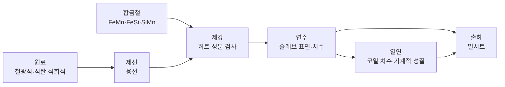

# KS 규격 정리

<aside>
📌

**이 문서의 역할**: 원료 → 용선 → 히트 → 슬래브 → 코일 → 출하 흐름에서 각 품목·검사가 참조할 KS 규격을 정리한다. 검사 기준(REQ-QC-002)과 강종 성분 규격(REQ-MST-002) 시드의 근거 문서로 쓴다.

**상태**: ✅ 공개 정보로 번호·명칭 확인 / 🟡 번호·현행 여부·수치를 KS 원문으로 확인 필요

**출처**: 한국표준정보망([kssn.net](http://kssn.net)), e-나라표준인증([standard.go.kr](http://standard.go.kr)) 공개 정보 및 업계 공개 자료. 수치는 시드용 참고값이며 확정 전 KS 원문 대조 필요

**관련 문서**: [요구사항 정의서](%EC%9A%94%EA%B5%AC%EC%82%AC%ED%95%AD%20%EC%A0%95%EC%9D%98%EC%84%9C%203eafd86222708082b7d5d917cab5da14.md), [용어 사전](%EC%9A%A9%EC%96%B4%20%EC%82%AC%EC%A0%84%203ebfd862227080e68127f2dadf67a855.md), [공통 코드 정의서](%EA%B3%B5%ED%86%B5%20%EC%BD%94%EB%93%9C%20%EC%A0%95%EC%9D%98%EC%84%9C%203ecfd862227080ad9553d6bcb92522f9.md)

**대시보드**: [공정별 KS 규격 맵](https://claude.ai/artifact/5mZyFHaeMBdUFz6YgDNqhv)

</aside>

## 1. 한눈에 보기

| 단계 | ERP 품목·LOT | KS 적용 방식 | 핵심 규격 |
| --- | --- | --- | --- |
| 원료 | RAW_MATERIAL / RM- | 구매 사양·공급업체 성적서 검토 기준 (입고 검사는 범위 제외) | KS E ISO 3082, KS E 3709, KS E 3071 |
| 합금철 | RAW_MATERIAL | 구매 사양·성분 확인 | KS D 0042, KS D 1901, KS D 1904, KS D 3717 |
| 제선 | HOT_METAL / HM- | KS 제품 규격 대상 아님 (사내 중간재) | 분석 시 KS D 1804·1805·1806 준용 |
| 제강 | HEAT / HT- | 히트 성분 판정 (강종 제품 규격의 화학성분) | KS D 1652, KS D 1673, KS D 3503·3515·3501 |
| 연주 | SLAB / 히트번호-SS | 슬래브 전용 KS 없음 → 사내 규격 | — (REQ-MST-003 제품 규격) |
| 열연 | COIL / C+슬래브번호 | 치수·기계적 성질 판정 | KS D 3501·3503·3515·3500, KS B 0801·0802·0804 |
| 출하 | 밀시트 | 검사 문서 기준 | KS D 0001 |

<aside>
⚠️

**2026-06-30 개정**: KS D 3503(일반 구조용 압연 강재, SS275)과 KS D 3500(열간 압연 강판 및 강대의 모양·치수·무게 및 허용차)이 개정되었다. KS D 3503은 2026판 원문 표 2·3으로 SS275 기호·기준값이 유지된 것을 확인했다(2026-10-01). KS D 3500도 2026판 원문을 확인했다. 해설에 따르면 2026 개정의 주요 내용은 무늬강판 추가(부속서 B 신설, 8절 겉모양 d) 신설)로, 일반 코일에는 영향이 없다.

</aside>

## 2. 원료

요구사항상 원료 입고 검사는 범위 제외(REQ-PUR-004). KS 규격은 구매 사양서와 공급업체 성적서를 검토하는 기준으로 사용한다.

| 품목 | 규격 번호 | 규격명 | 구분 | 상태 |
| --- | --- | --- | --- | --- |
| 철광석 | KS E ISO 3082 | 철광석 — 시료 채취 및 시료 준비 | 샘플링 | ✅ |
| 철광석 | KS E ISO 2597 계열 | 철광석 — 전철(Total Fe) 함유량 정량 | 분석 | 🟡 KS 부합 여부·부 번호 |
| 석탄·코크스 | KS E 3709 | 석탄 및 코크스 — 샘플링·분석 및 시험 방법 통칙 | 통칙 | ✅ 2025-08-29 확인 |
| 석탄·코크스 | KS E ISO 18283 | 석탄 및 코크스 — 수작업 샘플링 | 샘플링 | ✅ 2023-12-29 제정 |
| 석탄 | KS E ISO 589 | 석탄(하드콜) — 총 수분 정량 | 분석 | ✅ |
| 코크스 | KS E ISO 579 | 코크스 — 총 수분 함량 측정 | 분석 | ✅ |
| 석탄·코크스 | KS E ISO 562 | 석탄(하드콜)과 코크스 — 휘발분 정량 | 분석 | ✅ |
| 석탄·코크스 | KS E ISO 1171 | 고체 광물 연료 — 회분 정량 | 분석 | ✅ |
| 석탄·코크스 | KS E ISO 334 | 석탄 및 코크스 — 총 황 정량 (에쉬카 법) | 분석 | ✅ |
| 석회석 | KS E 3071 | 석회석의 화학 분석 방법 | 분석 | 🟡 현행 여부 |
| 석회석 | KS E 3075 | 석회석과 백운석의 형광 X선 분석 방법 | 분석 | 🟡 현행 여부 |
- 석탄 공업분석의 옛 규격 KS E 3705(석탄류 및 코크스류의 공업분석 방법)는 폐지되었고, 위 KS E ISO 규격으로 대체되었다.

## 3. 합금철

합금철은 원료 유형 FERROALLOY로 정의됐고(REQ-MST-001), 시드 품목은 실리코망가니즈(SiMn, KS D 3717) 1종이다. FeMn·FeSi는 참고용으로 남긴다. 강종(SS275·SM355A–D·SPHC)의 Mn·Si를 맞추는 일반 품목 기준으로 정리했다.

| 품목 | 규격 번호 | 규격명 | 구분 | 상태 |
| --- | --- | --- | --- | --- |
| 공통 | KS D 0042 | 페로알로이 성분용 시료의 샘플링 방법 (FeMn, FeSi, FeCr, SiMn, SiCr) | 샘플링 | ✅ 2024-09-13 확인 |
| 페로망가니즈 | KS D 1901 | 페로망간 분석 방법 | 분석 | ✅ |
| 페로실리콘 | KS D 1904 | 페로실리콘 분석 방법 | 분석 | ✅ |
| 실리코망가니즈 | KS D 3717 | 실리코망가니즈 | 제품 | ✅ 2023-06-16 확인 |
| 실리코망가니즈 | KS D 1830-1 | 실리콘 망가니즈 분석 방법 — 제1부: 망가니즈 정량 | 분석 | ✅ |
| 페로망가니즈·페로실리콘 | KS D 3712 / 3713 | 제품 규격 (KS D 0042 인용 목록) | 제품 | 🟡 번호별 품목 매칭 |

## 4. 제선 — 용선

- 용선은 판매하지 않는 사내 중간재로 KS 제품 규격 대상이 아니다. 요구사항에도 용선 검사는 없다.
- 성분을 기록할 경우 KS D 1804(탄소), KS D 1805(규소), KS D 1806(망가니즈, 2025-11-20 개정)을 준용한다.

## 5. 제강 — 히트 성분 검사

| 규격 번호 | 규격명 | 용도 | 상태 |
| --- | --- | --- | --- |
| KS D 1652 | 철 및 강 — 스파크 방전 원자 방출 분광 분석 방법 | 히트 성분 분석 | ✅ 2022-11-18 개정 |
| KS D 1673 | 강의 유도결합 플라스마 방출 분광 분석 방법 | 히트 성분 분석 | ✅ |
| KS D 1804·1805·1806 | 철 및 강 — C·Si·Mn 정량 | 개별 원소 분석 | ✅ |
| KS D 3503 / 3515 / 3501 | 강종 제품 규격의 화학성분 | 성분 규격 min/max (8장) | ✅ 3503은 2026판 원문 확인 |
- 검사 기준은 강종 × 공정 단위로 버전 관리한다(REQ-QC-002, 예: QS-SM355A-HR). KS가 개정되면 새 기준 버전을 만들고 기존 검사 기록은 당시 버전을 유지한다.

## 6. 연주 — 슬래브

- 슬래브 전용 KS 제품 규격은 확인되지 않았다. 성분은 히트에서 판정되고, 치수는 제품 규격(강종 × 두께 × 폭 × 길이, REQ-MST-003)이 기준이다.
- 슬래브 직접 출하 수주(REQ-SO-001)가 있으므로 표면·치수 검사 min/max는 사내 규격으로 정의해야 한다.
- 이론중량 = 두께 × 폭 × 길이 × 7.85 ÷ 10^9 (톤). 예: 250 × 1,200 × 10,000mm → 23.550톤

## 7. 열연 — 코일 검사

| 규격 번호 | 규격명 | 구분 | 상태 |
| --- | --- | --- | --- |
| KS D 3501 | 열간 압연 연강판 및 강대 (SPHC) | 제품 | ✅ 2023-06-16 확인 |
| KS D 3503 | 일반 구조용 압연 강재 (SS275) | 제품 | ✅ 2026-06-30 개정 (원문 확인) |
| KS D 3515 | 용접 구조용 압연 강재 (SM355A–D) | 제품 | ✅ 2023-06-16 확인 |
| KS D 3500 | 열간 압연 강판 및 강대의 모양, 치수, 무게 및 그 허용차 | 제품(치수) | ✅ 2026-06-30 개정 (원문 확인) |
| KS B 0801 | 금속 재료 인장 시험편 | 시험 | ✅ |
| KS B 0802 | 금속 재료 인장 시험 방법 | 시험 | ✅ |
| KS B 0804 | 금속 재료 굽힘 시험 | 시험 | ✅ |
| KS B 0809 / 0810 | 샤르피 충격 시험편 / 시험 방법 (SM 계열만) | 시험 | ✅ KS D 3515 인용표준으로 확인 |

## 7-1. 코일 치수 허용차 (KS D 3500:2026)

원문 표 5·7·10 기준(2026-10-01 확인). 코일 치수 검사(REQ-QC-001)의 min/max 근거로 쓴다. 단위 mm

<aside>
ℹ️

**KS와 프로젝트 설계의 차이**

- KS는 강대(코일)의 치수를 **두께 × 너비**로만 표시한다(4절 b). 코일 길이는 KS 치수가 아니다.
- KS는 강대의 무게를 **실측 무게(kg)**로 한다(7.2 a). 무게는 협정한 지정 무게 기준으로, 전체 강대수의 75% 이상이 지정 무게의 70% 이상이어야 한다(7.2 b).
- 프로젝트는 코일도 강종 × 두께 × 폭 × 길이 규격과 이론중량을 쓴다(REQ-MST-003, 실중량 계량은 범위 제외). 1개월 범위의 의도된 단순화로 설명한다.
</aside>

### 두께 허용차 (표 5)

| 두께 \ 너비 | 1200 미만 | 1200–1600 | 1600–2000 | 2000–2500 | 2500–3150 | 3150–4000 | 4000–5000 |
| --- | --- | --- | --- | --- | --- | --- | --- |
| 1.25 미만 | ±0.16 | ±0.16 | — | — | — | — | — |
| 1.25–1.60 | ±0.18 | ±0.18 | — | — | — | — | — |
| 1.60–2.00 | ±0.19 | ±0.19 | ±0.21 | — | — | — | — |
| 2.00–2.50 | ±0.20 | ±0.20 | ±0.23 | — | — | — | — |
| 2.50–3.15 | ±0.22 | ±0.22 | ±0.24 | ±0.26 | — | — | — |
| 3.15–4.00 | ±0.24 | ±0.24 | ±0.26 | ±0.27 | — | — | — |
| 4.00–5.00 | ±0.28 | ±0.28 | ±0.30 | ±0.31 | ±0.65 | — | — |
| 5.00–6.30 | ±0.33 | ±0.33 | ±0.34 | ±0.36 | ±0.75 | ±0.75 | — |
| 6.30–8.00 | ±0.38 | ±0.38 | ±0.39 | ±0.43 | — | — | — |
| 8.00–10.0 | ±0.42 | ±0.42 | ±0.43 | ±0.49 | — | — | — |
| 10.0–16.0 | ±0.50 | ±0.50 | ±0.51 | ±0.57 | ±0.80 | ±0.80 | ±1.00 |
| 16.0–25.0 | ±0.55 | ±0.55 | ±0.58 | ±0.63 | ±0.95 | ±0.95 | ±1.10 |
| 25.0–40.0 | ±0.55 | ±0.55 | ±0.58 | ±0.63 | ±1.00 | ±1.00 | ±1.20 |
| 40.0–63.0 | — | ±0.80 | ±0.95 | ±0.95 | ±1.10 | ±1.10 | ±1.30 |
| 63.0–100 | — | ±0.90 | ±1.10 | ±1.10 | ±1.30 | ±1.30 | ±1.50 |
| 100–160 | — | ±1.30 | ±1.50 | ±1.50 | ±1.70 | ±1.70 | ±1.90 |
| 160–200 | — | ±1.60 | ±1.80 | ±1.80 | ±1.90 | ±1.90 | ±2.10 |
| 200–250 | — | ±1.80 | ±1.90 | ±1.90 | ±2.00 | ±2.00 | ±2.20 |
| 250–300 | — | ±2.00 | ±2.10 | ±2.10 | ±2.20 | ±2.20 | ±2.50 |
| 300–350 | — | ±2.10 | ±2.30 | ±2.30 | ±2.40 | ±2.40 | ±2.80 |
- 구간은 "이상 – 미만" (마지막 행만 350 이하). 40mm 이상 행의 1200 미만 칸은 원문 공란
- 허용차 전체 범위가 같으면 플러스·마이너스 한쪽을 제한할 수 있다 (비고 1)
- **측정 위치** (비고 2): 밀 에지는 너비 50 이상이면 가장자리에서 25 이상 안쪽, 50 미만이면 중앙. 컨트 에지는 너비 30 이상이면 15 이상 안쪽, 30 미만이면 중앙

### 너비 허용차 (표 7)

밀 에지(압연 그대로)와 컨트 에지 A(보통 절단)를 정리. B(재절단·정밀 절단)·C(슬릿)는 원문 참조. 두께 구간: 3.15 미만 / 3.15–6.00 / 6.00–20.0 / 20.0 이상

| 너비 | 밀 에지 | 컨트 에지 A (+, 두께 구간별) | 컨트 에지 A (−) |
| --- | --- | --- | --- |
| 160 미만 | ±2 | 5 / 5 / 10 / 10 | 0 |
| 160–250 | ±2 | 5 / 5 / 10 / 15 | 0 |
| 250–400 | ±5 | 5 / 5 / 10 / 15 | 0 |
| 400–630 | +20 / 0 | 10 / 10 / 10 / 15 | 0 |
| 630–1000 | +25 / 0 | 10 / 10 / 10 / 15 | 0 |
| 1000–1250 | +25 / 0 | 10 / 10 / 15 / 15 | 0 |
| 1250–1600 | +25 / 0 | 10 / 10 / 15 / 15 | 0 |
| 1600 이상 | +30 / 0 | 10 / 10 / 1.2% / 1.2% | 0 |
- 너비 400 미만 밀 에지는 마이너스를 0으로 제한할 수 있고, 이때 플러스는 표 값의 2배
- 프로젝트 시드 코일(폭 1200–1500, 밀 에지)은 **+25 / 0**을 적용한다

### 가로 굽음(캠버) (표 10)

- 너비 250 미만: 임의의 길이 2000당 최대 8
- 너비 250 이상: 임의의 길이 2000당 최대 5

## 8. 강종별 기준값 (SPHC·SS275·SM355A)

공통 코드 정의서 STEEL_GRADE 시드 기준. 화학성분은 히트 검사, 기계적 성질은 코일 검사의 판정 기준이다. 단위: 성분 %, 강도 N/mm²

| 항목 | SPHC | SS275 | SM355A |
| --- | --- | --- | --- |
| KS 규격 | KS D 3501 | KS D 3503:2026 ✅ | KS D 3515:2018 ✅ |
| 구 기호 | — | SS400 | SM490A |
| C | 0.15 이하 | 0.25 이하 | 0.20 이하 (50mm 이하) / 0.22 이하 |
| Si | — | 0.45 이하 | 0.55 이하 |
| Mn | 0.60 이하 | 1.40 이하 | 1.60 이하 |
| P | 0.050 이하 | 0.050 이하 | 0.035 이하 |
| S | 0.050 이하 | 0.050 이하 | 0.035 이하 |
| 탄소당량 Ceq | — | — | 0.47 이하 (50mm 이하) / 0.49 이하 |
| 항복강도 | 규정 없음 | 275 이상 (16mm 이하), 265 이상 (16–40), 245 이상 (40–100), 235 이상 (100 초과) | 355 이상 (16mm 이하), 345 이상 (16–40), 335 이상 (40–75), 325 이상 (75–100), 305 이상 (100–200) |
| 인장강도 | 270 이상 | 410–550 | 490–630 |
| 연신율 | 27 이상 (1.2–1.6t), 29 이상 (1.6–3.2t), 31 이상 (3.2–14t) | 강판·강대: 21 이상 (5t 이하, 5호), 18 이상 (5–16, 1A호), 21 이상 (16–40, 1A호), 23 이상 (40 초과, 4호) | 22 이상 (5t 이하, 5호), 17 이상 (5–16, 1A호), 19 이상 (16–40, 1A호), 23 이상 (40 초과, 4호) |
| 샤르피 충격 | — | — | 20℃ 27J 이상 |
- SS275 값은 KS D 3503:2026 원문 표 2·3으로 확인(2026-10-01). 2018판과 동일하며, 굽힘성은 180°·안쪽 반지름 두께의 1.5배(주문자 요구 시만 시험)
- 두께 100mm를 초과하는 강판의 4호 시험편 연신율은 25mm마다 1%씩 감하며 최대 3%까지 감한다
- 두께 구간은 "초과 ~ 이하"로 판정한다 (예: 16–40 = 16 초과 40 이하)

## 8-1. SM355 등급별 차이 (KS D 3515:2018)

원문 표 2·3·7·8 기준(2026-10-01 확인). KS D 3515는 2018-12-27 개정 후 2023-06-16 확인 고시로 현행이다. 강도·연신율·Si·Mn·탄소당량은 A–D가 같고, **충격시험 온도와 P·S 상한**이 등급을 나눈다.

| 항목 | SM355A | SM355B | SM355C | SM355D |
| --- | --- | --- | --- | --- |
| 구 기호 | SM490A | SM490B | SM490C | — (2016 신설) |
| 샤르피 시험 온도 | 20℃ | 0℃ | −20℃ | −40℃ |
| 흡수 에너지 | 27J 이상 | 27J 이상 | 27J 이상 | 27J 이상 |
| C (50mm 이하 / 초과) | 0.20 / 0.22 이하 | 0.18 / 0.20 이하 | 0.18 / 0.20 이하 | 0.18 / 0.20 이하 |
| P, S | 0.035 이하 | 0.030 이하 | 0.025 이하 | 0.020 이하 |
- **공통 기준**: Si 0.55 이하, Mn 1.60 이하 / 항복강도 355·345·335·325·305 이상(16·40·75·100·200mm 구간) / 인장강도 490–630 / 탄소당량 0.47 이하(50mm 이하), 0.49 이하(50–100mm), 100mm 초과는 협정
- 탄소당량 = C + Mn/6 + (Cr+Mo+V)/5 + (Ni+Cu)/15. 협정 시 용접 균열 감수성(Pcm 0.27 이하 / 0.29 이하)으로 대신할 수 있다
- **샤르피 적용 조건**: 두께 6mm 초과, 시험편 3개 평균, V노치 압연 방향. 너비 10mm 미만 축소 시험편은 부속서 B. 형강의 SM355A는 주문자가 지정한 경우에만 적용
- **충격 재시험**: 3개 평균이 기준 미달이지만 85% 이상이면 3개를 더 시험해 6개 평균으로 판정
- **코일 관련**: 강대의 인장·충격 시험은 주문자 승인 시 생략할 수 있다(10.2.5)
- SM355B–D의 C는 원문 표 2에서 하나의 병합 칸(0.18 / 0.20 이하)이다 (2026-10-01 재확인)

## 9. 요구사항 미결정 사항 조사 결과

| 미결정 항목 | 조사 결과 | 제안 |
| --- | --- | --- |
| SS275 명칭 KS 원문 확인 (REQ-MST-002) | KS D 3503:2026 원문 표 2·3에서 SS275 기호와 기준값 유지 확인 (2018판과 동일) | ✅ 해결. SS275로 확정 |
| SM355 세부 등급 (A/B/C) | A–D는 강도가 같고 충격시험 조건으로 구분. 공개 자료 기준 SM355A도 20℃ 27J 기준 보유 | ✅ 결정(2026-10-01): A–D 모두 강종으로 등록하고 수주 시 선택. 시연 시드는 A·B, 상위 등급 대체 배정은 범위 제외 |

## 10. 후속 작업

- [x]  KS D 3503(2026-06-30 개정) 원문 확인 후 SS275 성분·기계적 성질 시드 확정
- [x]  KS D 3500(2026-06-30 개정) 원문 확인 후 코일 치수 허용차 검사 기준 확정
- [x]  합금철 품목 정의: 실리코망가니즈(SiMn) 1종
- [ ]  강종별 합금철 원단위 설정 (REQ-MST-006, 시연용 가정값)
- [ ]  슬래브 표면·치수 검사 min/max 사내 규격 정의
- [ ]  🟡 표시 항목 KS 원문 대조 후 ✅로 변경
- [x]  KS D 3515 원문(화학성분·기계적 성질·샤르피 표)으로 SM355A–D 등급별 기준값 확정